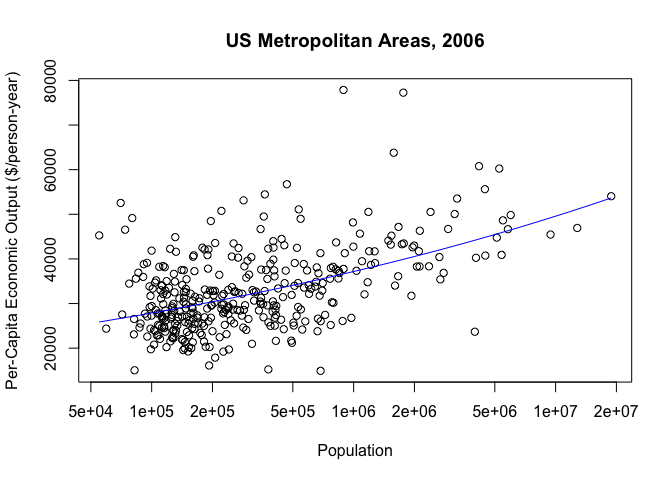

Agenda
======

-   Defining functions: Tying related commands into bundles
-   Interfaces: Controlling what the function can see and do
-   Example: Parameter estimation code

Why Functions?
==============

Data structures tie related values into one object

Functions tie related commands into one object

In both cases: easier to understand, easier to work with, easier to
build into larger things

For example
===========

    # Inputs: vector of numbers (x)
    # Outputs: vector with x^2 for small entries, 2|x|-1 for large ones
    psi.1 <- function(x) {
      psi <- ifelse(x^2 > 1, 2*abs(x)-1, x^2)
      return(psi)
    }

Our functions get used just like the built-in ones:

    z <- c(-0.5,-5,0.9,9)
    psi.1(z)

    ## [1]  0.25  9.00  0.81 17.00

Go back to the declaration and look at the parts:

    # Inputs: vector of numbers (x)
    # Outputs: vector with x^2 for small entries, |x| for large ones
    psi.1 <- function(x) {
      psi <- ifelse(x^2 > 1, 2*abs(x)-1, x^2)
      return(psi)
    }

**Interfaces**: the **inputs** or **arguments**; the **outputs** or
**return value**

Calls other functions `ifelse()`, `abs()`, operators `^` and `>`  
<small>could also call other functions we've written</small>

`return()` says what the output is  
<small>alternately, return the last evaluation; I like explicit returns
better</small>

**Comments**: Not required by R, but a Very Good Idea  
One-line description of purpose; listing of arguments; listing of
outputs

What should be a function?
==========================

-   Things you're going to re-run, especially if it will be re-run with
    changes
-   Chunks of code you keep highlighting and hitting return on
-   Chunks of code which are small parts of bigger analyses
-   Chunks which are very similar to other chunks

<small>will say more about design later</small>

Named and default arguments
===========================

    # Inputs: vector of numbers (x), scale for crossover (c)
    # Outputs: vector with x^2 for small entries, 2c|x|-c^2 for large ones
    psi.2 <- function(x,c=1) {
      psi <- ifelse(x^2 > c^2, 2*c*abs(x)-c^2, x^2)
      return(psi)
    }

    identical(psi.1(z), psi.2(z,c=1))

    ## [1] TRUE

Default values get used if names are missing:

    identical(psi.2(z,c=1), psi.2(z))

    ## [1] TRUE

Named arguments can go in any order when explicitly tagged:

    identical(psi.2(x=z,c=2), psi.2(c=2,x=z))

    ## [1] TRUE

Checking Arguments
==================

*Problem*: Odd behavior when arguments aren't as we expect

    psi.2(x=z,c=c(1,1,1,10))

    ## [1]  0.25  9.00  0.81 81.00

    psi.2(x=z,c=-1)

    ## [1]   0.25 -11.00   0.81 -19.00

*Solution*: Put little sanity checks into the code

    # Inputs: vector of numbers (x), scale for crossover (c)
    # Outputs: vector with x^2 for small entries, 2c|x|-c^2 for large ones
    psi.3 <- function(x,c=1) {
      # Scale should be a single positive number
      stopifnot(length(c) == 1,c>0)
      psi <- ifelse(x^2 > c^2, 2*c*abs(x)-c^2, x^2)
      return(psi)
    }

Arguments to `stopifnot()` are a series of expressions which should all
be TRUE; execution halts, with error message, at *first* FALSE (try it!)

What the function can see and do
================================

-   Each function has its own environment  
-   Names here over-ride names in the global environment  
-   Internal environment starts with the named arguments  
-   Assignments inside the function only change the internal
    environment  
    <small>There *are* ways around this, but they are difficult and best
    avoided; see Chambers, ch. 5, if you must</small>
-   Names undefined in the function are looked for in the environment
    the function gets called from  
    <small>*not* the environment of definition</small>

Internal environment examples
=============================

    x <- 7
    y <- 9
    adder <- function(y) { 
      x <- 1
      return(x+y) }
    adder(1)

    ## [1] 2

    x

    ## [1] 7

    y

    ## [1] 9

Assining value into global environment in function
==================================================

    x <- 7
    y <- 9
    adder <- function(y) { 
      x <<- 1
      return(x+y) }
    adder(1)

    ## [1] 2

    x

    ## [1] 1

    y

    ## [1] 9

Internal environment examples cont'd.
=====================================

    circle.area <- function(r) { return(pi*r^2) }
    circle.area(c(1,2,3))

    ## [1]  3.141593 12.566371 28.274334

    truepi <- pi
    pi <- 3   # Valid in 1800s Indiana, or drowned R'lyeh
    circle.area(c(1,2,3))

    ## [1]  3 12 27

    pi <- truepi      # Restore sanity
    circle.area(c(1,2,3))

    ## [1]  3.141593 12.566371 28.274334

Respect the Interfaces!
=======================

Interfaces mark out a controlled inner environment for our code

Interact with the rest of the system only at the interface

Advice: arguments explicitly give the function all the information

Likewise, output should only be through the return value

*More Read*: More example in the related paper of environment and
framework in your course homepage

Example: Fitting a Model
------------------------

Fact: bigger cities tend to produce more economically per capita

A proposed statistical model (Geoffrey West et al.):

*Y* = *y*0*N**a* + *n**o**i**s**e*

where *Y* is the per-capita "gross metropolitan product" of a city, *N*
is its population, and *y*0 and *a* are parameters

Evidence
========

    gmp <- read.table("https://smnajibi.github.io/statcomp/data/gmp.dat")
    gmp$pop <- gmp$gmp/gmp$pcgmp
    plot(pcgmp~pop, data=gmp, log="x", xlab="Population", 
      ylab="Per-Capita Economic Output ($/person-year)",
      main="US Metropolitan Areas, 2006")
    curve(6611*x^(1/8),add=TRUE,col="blue")

Want to fit the model
*Y* = *y*0*N**a* + *n**o**i**s**e*

Take *y*0 = 6611 for today

Approximate the derivative of error w.r.t *a* and move against it

An actual first attempt at code:

    maximum.iterations <- 100
    deriv.step <- 1/1000
    step.scale <- 1e-12
    stopping.deriv <- 1/100
    iteration <- 0
    deriv <- Inf
    a <- 0.15
    while((iteration < maximum.iterations)&&(deriv > stopping.deriv)) 
    {
      iteration <- iteration + 1
      mse.1 <- mean((gmp$pcgmp - 6611*gmp$pop^a)^2)
      mse.2 <- mean((gmp$pcgmp - 6611*gmp$pop^(a+deriv.step))^2)
      deriv <- (mse.2 - mse.1)/deriv.step
      a <- a - step.scale*deriv
    }
    list(a=a,iterations=iteration,converged=(iteration < maximum.iterations))

What's wrong with this?
=======================

-   Not *encapsulated*: Re-run by cutting and pasting code --- but how
    much of it? Also, hard to make part of something larger
-   *Inflexible*: To change initial guess at *a*, have to edit, cut,
    paste, and re-run
-   *Error-prone*: To change the data set, have to edit, cut, paste,
    re-run, and hope that all the edits are consistent
-   *Hard to fix*: should stop when *absolute value* of derivative is
    small, but this stops when large and negative. Imagine having five
    copies of this and needing to fix same bug on each.

Will turn this into a function and then improve it

First attempt, with logic fix:

    estimate.scaling.exponent.1 <- function(a) {
      maximum.iterations <- 100
      deriv.step <- 1/1000
      step.scale <- 1e-12
      stopping.deriv <- 1/100
      iteration <- 0
      deriv <- Inf
      while ((iteration < maximum.iterations) && (abs(deriv) > stopping.deriv)) {
        iteration <- iteration + 1
        mse.1 <- mean((gmp$pcgmp - 6611*gmp$pop^a)^2)
        mse.2 <- mean((gmp$pcgmp - 6611*gmp$pop^(a+deriv.step))^2)
        deriv <- (mse.2 - mse.1)/deriv.step
        a <- a - step.scale*deriv
      }
      fit <- list(a=a,iterations=iteration,
        converged=(iteration < maximum.iterations))
      return(fit)
    }

*Problem*: All those magic numbers!

*Solution*: Make them defaults

    estimate.scaling.exponent.2 <- function(a, y0=6611,
      maximum.iterations=100, deriv.step = .001,
      step.scale = 1e-12, stopping.deriv = .01) {
      iteration <- 0
      deriv <- Inf
      while ((iteration < maximum.iterations) && (abs(deriv) > stopping.deriv)) {
        iteration <- iteration + 1
        mse.1 <- mean((gmp$pcgmp - y0*gmp$pop^a)^2)
        mse.2 <- mean((gmp$pcgmp - y0*gmp$pop^(a+deriv.step))^2)
        deriv <- (mse.2 - mse.1)/deriv.step
        a <- a - step.scale*deriv
      }
      fit <- list(a=a,iterations=iteration,
        converged=(iteration < maximum.iterations))
      return(fit)
    }

*Problem:* Why type out the same calculation of the MSE twice?  
*Solution:* Declare a function

    estimate.scaling.exponent.3 <- function(a, y0=6611,
      maximum.iterations=100, deriv.step = .001,
      step.scale = 1e-12, stopping.deriv = .01) {
      iteration <- 0
      deriv <- Inf
      mse <- function(a) { mean((gmp$pcgmp - y0*gmp$pop^a)^2) }
      while ((iteration < maximum.iterations) && (abs(deriv) > stopping.deriv)) {
        iteration <- iteration + 1
        deriv <- (mse(a+deriv.step) - mse(a))/deriv.step
        a <- a - step.scale*deriv
      }
      fit <- list(a=a,iterations=iteration,
        converged=(iteration < maximum.iterations))
      return(fit)
    }

<small>`mse()` declared inside the function, so it can see `y0`, but
it's not added to the global environment</small>

*Problem:* Locked in to using specific columns of `gmp`; shouldn't have
to re-write just to compare two data sets  
*Solution:* More arguments, with defaults

    estimate.scaling.exponent.4 <- function(a, y0=6611,
      response=gmp$pcgmp, predictor = gmp$pop,
      maximum.iterations=100, deriv.step = .001,
      step.scale = 1e-12, stopping.deriv = .01) {
      iteration <- 0
      deriv <- Inf
      mse <- function(a) { mean((response - y0*predictor^a)^2) }
      while ((iteration < maximum.iterations) && (abs(deriv) > stopping.deriv)) {
        iteration <- iteration + 1
        deriv <- (mse(a+deriv.step) - mse(a))/deriv.step
        a <- a - step.scale*deriv
      }
      fit <- list(a=a,iterations=iteration,
        converged=(iteration < maximum.iterations))
      return(fit)
    }

Respecting the interfaces: We could turn the `while()` loop into a
`for()` loop, and nothing outside the function would care

    estimate.scaling.exponent.5 <- function(a, y0=6611,
      response=gmp$pcgmp, predictor = gmp$pop,
      maximum.iterations=100, deriv.step = .001,
      step.scale = 1e-12, stopping.deriv = .01) {
      mse <- function(a) { mean((response - y0*predictor^a)^2) }
      for (iteration in 1:maximum.iterations) {
        deriv <- (mse(a+deriv.step) - mse(a))/deriv.step
        a <- a - step.scale*deriv
        if (abs(deriv) <= stopping.deriv) { break() }
      }
      fit <- list(a=a,iterations=iteration,
        converged=(iteration < maximum.iterations))
      return(fit)
    }

What have we done?
==================

The final code is shorter, clearer, more flexible, and more re-usable

*Exercise:* Run the code with the default values to get an estimate of
*a*; plot the curve along with the data points

*Exercise:* Randomly remove one data point --- how much does the
estimate change?

*Exercise:* Run the code from multiple starting points --- how different
are the estimates of *a*?

Summary
=======

-   **Functions** bundle related commands together into objects: easier
    to re-run, easier to re-use, easier to combine, easier to modify,
    less risk of error, easier to think about
-   **Interfaces** control what the function can see (arguments,
    environment) and change (its internals, its return value)
-   **Calling** functions we define works just like calling built-in
    functions: named arguments, defaults

We will work with many functions after that
