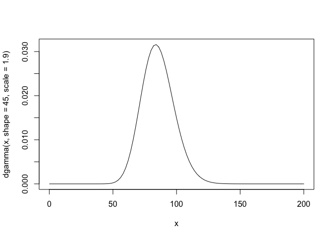
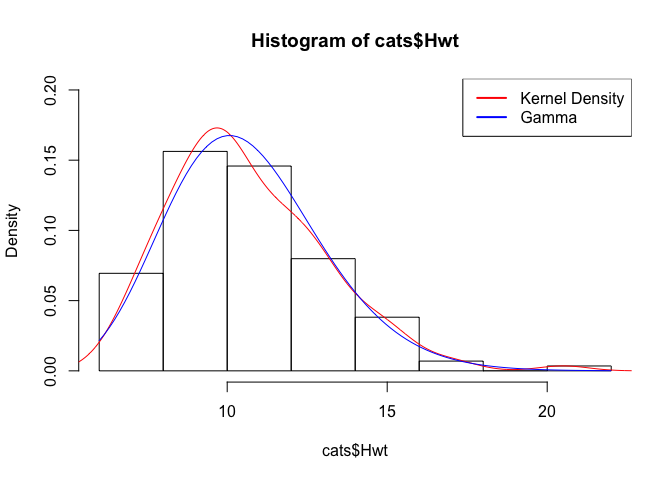

Today
-----

-   How *does* R get "random" numbers, anyway?
-   It doesn't, really -- it uses a trick that should be
    indistinguishable from the real McCoy

These Cost Money and I'm Cheap
------------------------------

Pseudorandom generators produce a deterministic sequence that is
indistiguishable from a true random sequence if you don't know how it
started.

Example: `runif`, where we know where it started
------------------------------------------------

    runif(1:10)

    ##  [1] 0.71930071 0.85942418 0.03927117 0.53755767 0.54430654 0.60104117
    ##  [7] 0.71011431 0.84765704 0.57933300 0.06540307

    set.seed(10)
    runif(1:10)

    ##  [1] 0.50747820 0.30676851 0.42690767 0.69310208 0.08513597 0.22543662
    ##  [7] 0.27453052 0.27230507 0.61582931 0.42967153

    set.seed(10)
    runif(1:10)

    ##  [1] 0.50747820 0.30676851 0.42690767 0.69310208 0.08513597 0.22543662
    ##  [7] 0.27453052 0.27230507 0.61582931 0.42967153

How does R get everything we need?
----------------------------------

A few distributions of interest:

-   Discret Uniform{1,...,n}
-   Uniform(0,1)
-   Bernoulli(p)
-   Binomial(n,p)
-   normal(mu,sigma)
-   Exponential(lambda)
-   Gamma(n,lambda)

`sample()`
----------

Use `sample` function to generate random number from a discret uniform
distribution

    sample(1:10,size = 5,replace = T)

    ## [1] 7 6 2 6 4

    sample(10,size = 5,replace = T) # if the first argument is not vector

    ## [1] 5 1 3 4 9

In R: everything we need
------------------------

Suppose we were working with the Exponential distribution.

-   `rexp()` generates variates from the distribution.
-   `dexp()` gives the probability density function.
-   `pexp()` gives the cumulative distribution function.
-   `qexp()` gives the quantiles.

R commands for distributions
----------------------------

-   `d`*foo* = the probability *d* ensity (if continuous) or probability
    mass function of *foo* (pdf or pmf)
-   `p`*foo* = the cumulative *p* robability function (CDF)
-   `q`*foo* = the *q* uantile function (inverse to CDF)
-   `r`*foo* = draw *r* andom numbers from `foo` (first argument always
    the number of draws)

`?Distributions` to see which distributions are built in

If you write your own, follow the conventions

Examples
--------

    dnorm(x=c(-1,0,1),mean=1,sd=0.1)

    ## [1] 5.520948e-87 7.694599e-22 3.989423e+00

    pnorm(q=c(2,-2)) # defaults to mean=0,sd=1

    ## [1] 0.97724987 0.02275013

    dbinom(5,size=7,p=0.7,log=TRUE)

    ## [1] -1.146798

    qchisq(p=0.95,df=5)

    ## [1] 11.0705

    rt(n=4,df=2)

    ## [1]  1.0154673 -0.1983909  0.9861791 -1.5666848

Displaying Probability Distributions
------------------------------------

`curve` is very useful for the `d`, `p`, `q` functions:

    curve(dgamma(x,shape=45,scale=1.9),from=0,to=200)

N.B.: the `r` functions aren't things it makes much sense to plot

How Do We Fit Distributional Models to the Data?
------------------------------------------------

-   Match moments (mean, variance, etc.)
-   Match other summary statistics
-   Maximize the likelihood

Method of Moments (MM), Closed Form
-----------------------------------

-   Pick enough moments that they **identify** the parameters
    -   At least 1 moment per parameter; algebraically independent
-   Write equations for the moments in terms of the parameters  
    e.g., for gamma
    $$
    E(X) = \\bar{x}  ~,~ E(X^2) = \\bar{x^2}
    $$
-   Do the algebra by hand to solve the equations
    $$
    shape=\\bar{x}^2/s^2 ~,~ scale = s^2/\\bar{x}
    $$

<!-- -->

    gamma.est_MM <- function(x) {
      m <- mean(x); v <- var(x)
      return(c(shape=m^2/v, scale=v/m))
    }

Maximum Likeihood
-----------------

-   Usually we think of the parameters as fixed and consider the
    probability of different outcomes, *f*(*x*; *θ*) with *θ* constant
    and *x* changing **Likelihood** of a parameter

-   With independent data points
    *x*1, *x*2, …, *x**n*, likelihood
    is
    $$
    L(\\theta) = \\prod\_{i=1}^{n}{f(x\_i;\\theta)}
    $$
-   Multiplying lots of small numbers is numerically bad; take the log:
    $$
    \\ell(\\theta) = \\sum\_{i=1}^{n}{\\log{f(x\_i;\\theta)}}
    $$

------------------------------------------------------------------------

-   In pseudo-code:

<!-- -->

    loglike.foo <- function(params, x) {
      sum(dfoo(x=x,params,log=TRUE))
    }

What Do We Do with the Likelihood?
----------------------------------

-   We maximize it!
-   Sometimes we can do the maximization by hand with some calculus
    -   For Gaussian, MLE = just match the mean and variance
    -   For Pareto, MLE
        $\\widehat{a} = 1 + 1/\\overline{\\log{(x/x\_{\\mathrm{min}})}}$
-   Doing numerical optimization
    -   Stick in a minus sign if we're using a minimization function

fitdistr
--------

MLE for one-dimensional distributions can be done through `fitdistr` in
the `MASS` package

It knows about most the standard distributions, but you can also give it
arbitrary probability density functions and it will try to maximize
them  
A starting value for the optimization is optional for some
distributions, required for others (including user-defined densities)

Returns the parameter estimates and standard errors  
SEs come from large-*n* approximations so use cautiously

fitdistr Examples
-----------------

Fit the gamma distribution to the cats' hearts:

    require(MASS)

    ## Loading required package: MASS

    fitdistr(cats$Hwt, densfun="gamma")

    ##      shape         rate   
    ##   20.2998092    1.9095724 
    ##  ( 2.3729250) ( 0.2259942)

Returns: estimates above, standard errors below

Checking Your Estimator
-----------------------

-   simulate, then estimate; estimates should converge as the sample
    grows

<!-- -->

    gamma.est_MM(rgamma(100,shape=19,scale=45))

    ##    shape    scale 
    ## 20.03284 43.16644

    gamma.est_MM(rgamma(1e5,shape=19,scale=45))

    ##    shape    scale 
    ## 19.00715 44.88471

    gamma.est_MM(rgamma(1e6,shape=19,scale=45))

    ##    shape    scale 
    ## 18.99766 45.01638

Checking the Fit
----------------

*Use your eyes*: Graphic overlays of theory vs. data

    hist(cats$Hwt,prob=T,ylim=c(0,.2))
    lines(density(cats$Hwt),col=2)
    cats.gamma <- gamma.est_MM(cats$Hwt)
    curve(dgamma(x,shape=cats.gamma["shape"],scale=cats.gamma["scale"]),add=TRUE,col="blue")
    legend("topright",c("Kernel Density","Gamma"),col=c(2,4),lty=1,lwd=2)

Kolmogorov-Smirnov Test
-----------------------

-   How much should the QQ plot wiggle around the diagonal?
-   Answer a different question...
-   Biggest gap between theoretical and empirical CDF:
    $$
    D\_{KS} = \\max\_{x}{\\left|F(x)-\\widehat{F}(x)\\right|}
    $$
-   Useful because *D**K**S* always has the same distribution
    *if* the theoretical CDF is fixed and correct
-   Also works for comparing the empirical CDFs of two samples, to see
    if they came from the same distribution

KS Test, Data vs. Theory
------------------------

    test.data <- rnorm(100,.5,.1)
    ks.test(test.data,pnorm,mean=.1,sd=0.1)

    ## 
    ##  One-sample Kolmogorov-Smirnov test
    ## 
    ## data:  test.data
    ## D = 0.97792, p-value < 2.2e-16
    ## alternative hypothesis: two-sided

Ex: How does it works for other distributions?

Chi-Squared Test for Discrete Distributions
-------------------------------------------

Compare an actual table of counts to a hypothesized probability
distribution:

    coin <- rbinom(100,1,.45); chisq.test(table(coin),p=c(1/2,1/2))

    ## 
    ##  Chi-squared test for given probabilities
    ## 
    ## data:  table(coin)
    ## X-squared = 0.04, df = 1, p-value = 0.8415

    coin <- rbinom(1000,1,.45) ; chisq.test(table(coin),p=c(1/2,1/2))

    ## 
    ##  Chi-squared test for given probabilities
    ## 
    ## data:  table(coin)
    ## X-squared = 29.584, df = 1, p-value = 5.355e-08

Chi-Squared Test: Degrees of Freedom
------------------------------------

-   The *df* is the number of cells in the table −1
-   If we estimate *q* parameters, we need to subtract *q* degrees of
    freedom

Chi-Squared Test for Continuous Distributions
---------------------------------------------

-   Divide the range into bins and count the number of observations in
    each bin; this will be `x` in `chisq.test()`
-   Use the CDF function `p` *foo* to calculate the theoretical
    probability of each bin; this is `p`
-   Plug in to `chisq.test`
-   If parameters are estimated, adjust

Chi-Squared for Continuous Data (cont'd.)
-----------------------------------------

-   `hist()` gives us break points and counts:

<!-- -->

    cats.hist <- hist(cats$Hwt,plot=FALSE)
    cats.hist$breaks

    ## [1]  6  8 10 12 14 16 18 20 22

    cats.hist$counts

    ## [1] 20 45 42 23 11  2  0  1

Chi-Squared for Continuous Data (cont'd.)
-----------------------------------------

Use these for a *χ*2 test:

    # Why the padding by -Inf and Inf?
    p <- diff(pgamma(c(-Inf,cats.hist$breaks,Inf),shape=cats.gamma["shape"],
                     scale=cats.gamma["scale"]))
    # Why the padding by 0 and 0?
     chisq.test(c(0,cats.hist$counts,0),p=p)

    ## 
    ##  Chi-squared test for given probabilities
    ## 
    ## data:  c(0, cats.hist$counts, 0)
    ## X-squared = 12.133, df = 9, p-value = 0.2059

Don't need to run `hist` first; can also use `cut` to discretize (see
`?cut`)

Summary
-------

-   Visualizing and computing empirical distribution
-   Parametric distributions are models
-   Methods of fitting: moments and likelihood
-   Methods of checking: visual comparisons, other statistics, tests,
    calibration
